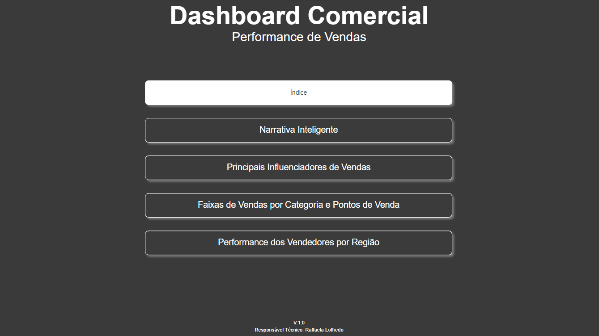
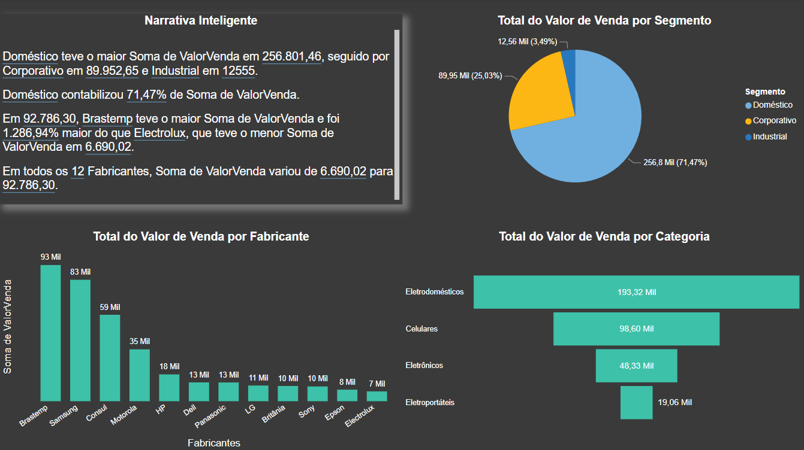
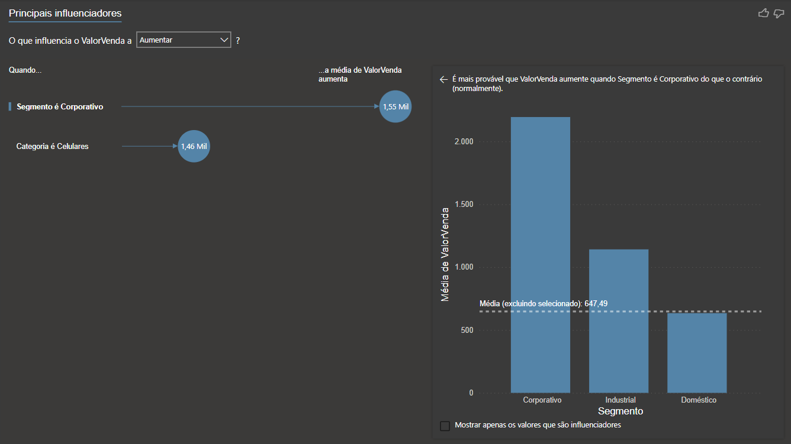
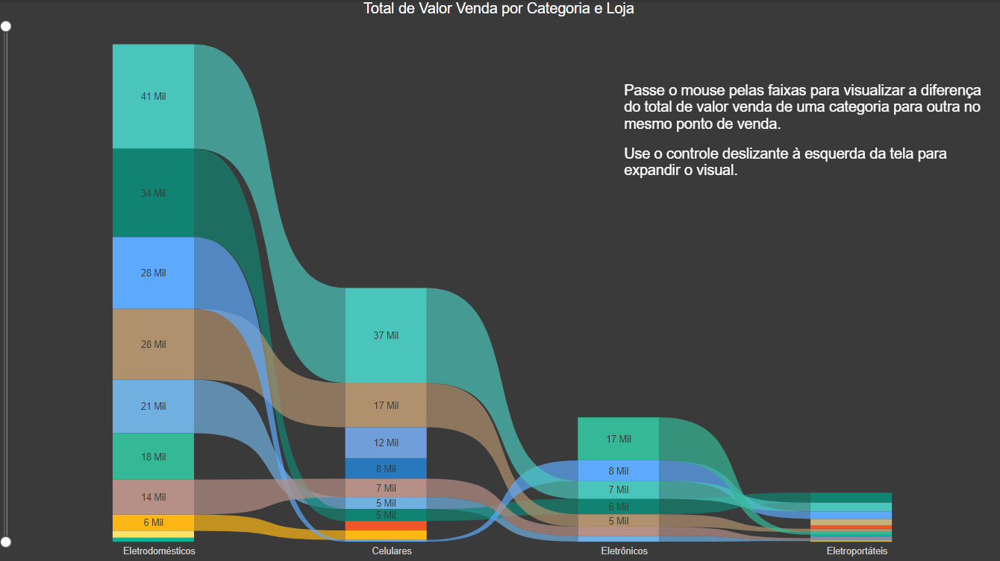
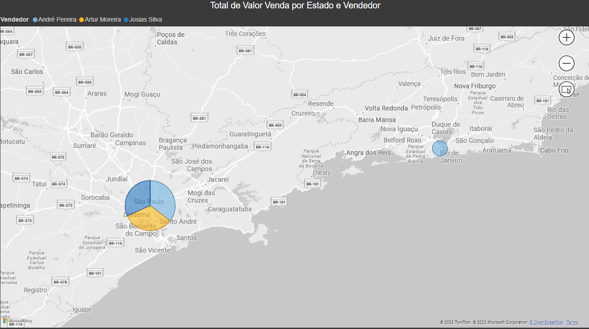

# Dashboard Comercial
 

  

 

## Sobre o projeto
O objetivo desse projeto foi construir visualizações de dados para melhor entender a performence de vendas da empresa fictícia. Utilizou-se recursos adicionais do PowerBI como a Narrativa Inteligente, gráfico de faixas, mapa e principais influenciadores. Além disso, foi criado um menu interativo para facilitar o acesso aos painéis (imagem acima).

* **[Projeto na íntegra (disponível para download)](https://github.com/raffaloffredo/dashboard_comercial/blob/main/dashboard_comercial.pbix)**
 

O primeiro painel, denominado Narrativa Inteligente, analisa o valor total de vendas por segmento, por fabricante e por categoria de produto.

  

 

No segundo painel, denominado Principais Influenciadores, pode ser verificado que mais influencia no valor da venda ser maior ou menor. Por exemplo, na imagem vemos que o que mais influencia o valor da venda ser maior são do segmento corporativo, na categoria de produtos celulares.

  

 

O terceiro painel é formado por um gráfico de faixas onde se pode acessar o valor da venda por categoria e discriminado por loja.

  

 

No último painel, temos um mapa com gráfico quem mostra os principais vendedores por Estado.

  

 

## Material Extra
Os dados utilizados nesse projeto também estão disponíveis para download.

* **[Dataset Comercial](https://github.com/raffaloffredo/dashboard_comercial/blob/main/dados_comercial.xlsx)**
 

## Outros projetos

* **[Dashboard de Marketing](https://github.com/raffaloffredo/dashboard_marketing)**
* **[Dashboard de Vendas](https://github.com/raffaloffredo/dashboard_vendas)**
* **[Dashboard de Vendas Globais](https://github.com/raffaloffredo/dashboard_vendas_globais/)**
* **[Airbnb New York](https://github.com/raffaloffredo/airbnb_new_york_portuguese)**
* **[Estudo atualizado sobre COVID-19 no Brasil e no mundo](https://github.com/raffaloffredo/covid_2023_portuguese)**
* **[Detecção de fraude em cartão de crédito](https://github.com/raffaloffredo/fraud_detection_portuguese)**
 

 ## Contatos

  
  
  
  

